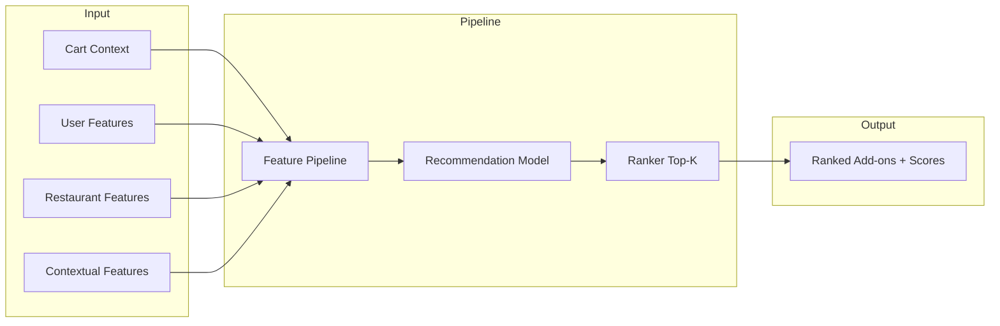

# CSAO System Architecture

## Overview

The Cart Super Add-On (CSAO) rail recommendation system suggests add-on items to users based on their current cart, context, and historical behavior. It is designed for **real-time** serving with a **< 300 ms** latency target.

## High-Level Flow

## Components

| Component | Location | Role |
|-----------|----------|------|
| Feature pipeline | `src/features/` | User, restaurant, cart, context features; candidate generation |
| Model training | `src/model/train.py` | Temporal split, LightGBM binary classifier, saves model + feature list |
| Inference | `src/model/predict.py` | Load model, align features, score candidates, top-K |
| Cold start | `src/features/cold_start.py` | Popularity-based fallback + diversity (category mix) |
| API | `src/api/service.py` | FastAPI POST /recommend, /health, /ready |
| Evaluation | `src/evaluation/` | AUC, P@K, R@K, NDCG; baseline comparison |

## Data Flow

1. **Training:** Orders + order_items + menu_items + users + restaurants → feature matrix (per order, per candidate item) with label (add-on or not) → temporal split → LightGBM fit → saved model + `feature_columns.yaml`.
2. **Inference:** Request (user_id, restaurant_id, cart_item_ids, context) → load user/restaurant/item features (from cache/CSV) → build inference matrix for candidates → align columns to training → score → sort and return top-K with latency logged.
3. **Cold start:** If user or restaurant unknown (or model not loaded), return popularity-based recommendations with diversity (max per category in top-K).

## Scalability

- **Latency:** Feature tables (user, restaurant, item) are precomputed and loaded at startup; only cart + context are computed per request. Candidate set is capped (e.g. 50) to stay within 200–300 ms.
- **Scale:** For millions of requests, precomputed features would be served from a feature store/cache; model inference is a single LightGBM predict over a small matrix per request.

## Configuration

- `configs/features.yaml`: feature flags, candidate max count, latency target.
- `configs/model.yaml`: LightGBM params, temporal split ratios, inference top_k.

## Trade-offs and Limitations

- **Pointwise model:** We use binary classification (add vs not add) per candidate; pairwise/listwise LTR could improve ranking at higher complexity.
- **Cold start:** New users/restaurants get popularity + diversity only; no personalization until history exists.
- **Data freshness:** User/restaurant features are built from static CSVs at startup; production would refresh periodically or via streaming.
